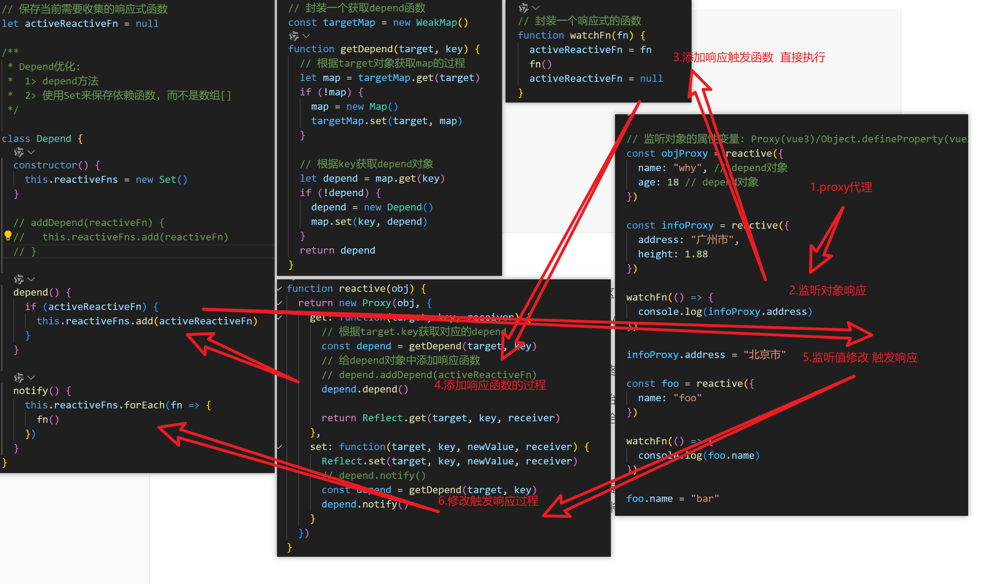

# Vue复习

## 响应性原理

将一个或多个目标变量采用proxy代理劫持，视作依赖并收集起来，任意变量发生数据变化时触发更新执行变化。

使用ref或者reactive会将变量作为依赖，采用WeakMap来收集依赖，
变量变化时遍历依赖找到对应变量进行更新操作。

```javascript
// 保存当前需要收集的响应式函数
let activeReactiveFn = null

/**
 * Depend优化:
 *  1> depend方法
 *  2> 使用Set来保存依赖函数, 而不是数组[]
 */

class Depend {
  constructor() {
    this.reactiveFns = new Set()
  }

  depend() {
    if (activeReactiveFn) {
      this.reactiveFns.add(activeReactiveFn)
    }
  }

  notify() {
    this.reactiveFns.forEach(fn => {
      fn()
    })
  }
}

// 封装一个响应式的函数
function watchFn(fn) {
  activeReactiveFn = fn
  fn()
  activeReactiveFn = null
}

// 封装一个获取depend函数
const targetMap = new WeakMap()
function getDepend(target, key) {
  // 根据target对象获取map的过程
  let map = targetMap.get(target)
  if (!map) {
    map = new Map()
    targetMap.set(target, map)
  }

  // 根据key获取depend对象
  let depend = map.get(key)
  if (!depend) {
    depend = new Depend()
    map.set(key, depend)
  }
  return depend
}

function reactive(obj) {
  return new Proxy(obj, {
    get: function(target, key, receiver) {
      // 根据target.key获取对应的depend
      const depend = getDepend(target, key)
      // 给depend对象中添加响应函数
      depend.depend()
  
      return Reflect.get(target, key, receiver)
    },
    set: function(target, key, newValue, receiver) {
      Reflect.set(target, key, newValue, receiver)
      // depend.notify()
      const depend = getDepend(target, key)
      depend.notify()
    }
  })
}

// 监听对象的属性变量: Proxy(vue3)/Object.defineProperty(vue2)
const objProxy = reactive({
  name: "why", // depend对象
  age: 18 // depend对象
})

const infoProxy = reactive({
  address: "广州市",
  height: 1.88
})

watchFn(() => {
  console.log(infoProxy.address)
})

infoProxy.address = "北京市"

const foo = reactive({
  name: "foo"
})

watchFn(() => {
  console.log(foo.name)
})

foo.name = "bar"

```




## v-if vs v-show

v-if 是“真实的”按条件渲染，因为它确保了在切换时，条件区块内的事件监听器和子组件都会被销毁与重建。

v-if 也是惰性的：如果在初次渲染时条件值为 false，则不会做任何事。条件区块只有当条件首次变为 true 时才被渲染。

相比之下，v-show 简单许多，元素无论初始条件如何，始终会被渲染，只有 CSS display 属性会被切换。

总的来说，v-if 有更高的切换开销，而 v-show 有更高的初始渲染开销。因此，如果需要频繁切换，则使用 v-show 较好；如果在运行时绑定条件很少改变，则 v-if 会更合适。

## v-for 的 key

 key是给每一个vnode的唯一id，也是diff的一种优化策略，可以根据key，更准确， 更快的找到对应的vnode节点 


key 这个特殊的 attribute 主要作为 Vue 的虚拟 DOM 算法提示，在比较新旧节点列表时用于识别 vnode。
同一个父元素下的子元素必须具有唯一的 key。重复的 key 将会导致渲染异常。

## nextTick

 在下次 DOM 更新循环结束之后执行延迟回调。在修改数据之后立即使用这个方法，获取更新后的 DOM 。


在 Vue 3 中 nextTick() 方法的行为和 Vue 2 中基本相似，但它进行了一些优化，以提高性能和稳定性。nextTick() 通过利用微任务（microtask）来确保在 DOM 更新之后执行回调，从而避免在同一事件循环中执行 DOM 操作。简单的理解是，当数据更新了，在dom中渲染后，自动执行函数。

原文链接：https://blog.csdn.net/aaa123aaasqw/article/details/140180854


### vue3 和 vue2 的区别

1、代码编写方式，V3 引入的 Composition api 相对于 V2 的优势
2、对 template 模板的编制优化，缩小了 template 模板和 JSX 的差距
3、响应式的差异及 V3 优化后的优势
4、diff 算法的优化
5、TS 引入的优点和缺点
6、V3 的引入的 hook 相对于 V2 的优势，V2 用 mixins 的缺点


## 虚拟DOM

为了减少直接操作DOM，生成虚拟DOM, 转成VNode节点，配合diff算法一次性更新变化后再操作DOM  提升性能。

## diff算法

`diff` 算法是一种通过同层的树节点进行比较的高效算法

其有两个特点：

- 比较只会在同层级进行, 不会跨层级比较
- 在diff比较的过程中，循环从两边向中间比较

`diff` 算法在很多场景下都有应用，在 `vue` 中，作用于虚拟 `dom` 渲染成真实 `dom` 的新旧 `VNode` 节点比较


vue3引入了最长递增子序列的算法，主要时找到最长复用子序列，减少不必要的节点移动操作，提升性能

## 如何制作一个弹窗组件

1. 创建一个遮罩层的div，定位fixed，长宽100%，然后选择background半透明
2. 创建一个弹窗主体div，也采用定位方式， 水平居中，长宽可以留给props去传
3. 声明一个响应式变量 show 的布尔值来控制显隐, 
4. 创建函数openModal onCancel onOk 并defineEmit出去，作为回调函数给父级接收和控制
5. 给遮罩层加一个 @click.self = "onBlur"  点击遮罩层取消
6. defineProps传值 基础的title和content，还有样式等
7. 在外层使用teleport to="body" 标签包裹（ 模态框通常需要覆盖整个页面，  并且应该渲染在页面的最顶层，而不是它们在组件结构中的位置。使用Teleport可以将模态框的内容移动到页面的最顶层，确保其覆盖其他内容‌ ）
8. 导出，挂载到app.componet('modal', modal)


## vite打包性能优化

- rollupOptions 开启代码分包
- 去除console.log debugger
- CDN加速  vue elementPlus echarts
- 按需导入
- 文件压缩： 静态资源 gzip 体积设置阈值 过大压缩
- 图片压缩

```javascript
// vite.config.js
import { defineConfig } from 'vite'
import { createHtmlPlugin } from 'vite-plugin-html'
import viteImagemin from 'vite-plugin-imagemin'
import externalGlobals from 'rollup-plugin-external-globals'
import { visualizer } from 'rollup-plugin-visualizer'
import viteCompression from 'vite-plugin-compression'
// https://vitejs.dev/config/
export default defineConfig({
  plugins: [
    visualizer({ open: true }),
    // 将下面的添加到plugin下
    createHtmlPlugin({
      minify: true,
      inject: {
        data: {
          vuescript: '<script src="https://cdn.jsdelivr.net/npm/vue@3.2.25"></script>',
          demiScript: '<script src="//cdn.jsdelivr.net/npm/vue-demi@0.13.7"></script>',
          elementPlusScript: `
            <link href="https://cdn.jsdelivr.net/npm/element-plus@2.2.22/dist/index.min.css" rel="stylesheet">
            <script src="https://cdn.jsdelivr.net/npm/element-plus@2.2.22/dist/index.full.min.js"></script>
          `,
          echartsSciprt: '<script src="https://cdn.jsdelivr.net/npm/echarts@5.0.2/dist/echarts.min.js"></script>'
        }
      }
    }),
    viteImagemin({
      gifsicle: {
        optimizationLevel: 7,
        interlaced: false
      },
      optipng: {
        optimizationLevel: 7
      },
      mozjpeg: {
        quality: 20
      },
      pngquant: {
        quality: [0.8, 0.9],
        speed: 4
      },
      svgo: {
        plugins: [
          {
            name: 'removeViewBox'
          },
          {
            name: 'removeEmptyAttrs',
            active: false
          }
        ]
      }
    })
  ],
  build: {
    target: 'es2020',
    minify: 'terser',
    // rollup 配置
    rollupOptions: {
      output: {
        chunkFileNames: 'js/[name]-[hash].js', // 引入文件名的名称
        entryFileNames: 'js/[name]-[hash].js', // 包的入口文件名称
        assetFileNames: '[ext]/[name]-[hash].[ext]', // 资源文件像 字体，图片等
        manualChunks(id) {
          if (id.includes('node_modules')) {
            return 'vendor'
          }
        }
      },
      //  告诉打包工具 在external配置的 都是外部依赖项  不需要打包
      external: ['vue', 'element-plus', 'echarts'],
      plugins: [
        externalGlobals({
          vue: 'Vue',
          'element-plus': 'ElementPlus',
          echarts: 'echarts',
          'vue-demi': 'VueDemi'
        }),
        viteCompression({
          verbose: true, // 是否在控制台中输出压缩结果
          disable: false,
          threshold: 10240, // 如果体积大于阈值，将被压缩，单位为b，体积过小时请不要压缩，以免适得其反
          algorithm: 'gzip', // 压缩算法，可选['gzip'，' brotliccompress '，'deflate '，'deflateRaw']
          ext: '.gz',
          deleteOriginFile: false // 源文件压缩后是否删除
        })
      ]
    },
    terserOptions: {
      compress: {
        // 生产环境时移除console
        drop_console: true,
        drop_debugger: true
      }
    }
  }
})
```

## 封装echarts组件

1. 创建div，作为绑定容器
2. onMounted时，使用nextTick接收初始化函数
3. echarts的基本配置可以先根据文档，将必要的组件加入并使用，自定义需要的图表类别，导出echarts
4. 初始化函数，使用自定义的echarts，用 echarts.init生成实例
5. 制作绘制函数  wacth监听prop传入的option echarts.setOption进行绘制
6. onMounted再添加 resize监听函数 加入防抖 图表响应式变化
7. 在onBeforeMounted时释放实例，移除resize监听

## Vue3的Tree-shaking

 `Tree shaking` 是一种通过清除多余代码方式来优化项目打包体积的技术

`Tree shaking`是基于`ES6`模板语法（`import`与`exports`），主要是借助`ES6`模块的静态编译思想，在编译时就能确定模块的依赖关系，以及输入和输出的变量

`Tree shaking`无非就是做了两件事：

- 编译阶段利用`ES6 Module`判断哪些模块已经加载
- 判断那些模块和变量未被使用或者引用，进而删除对应代码